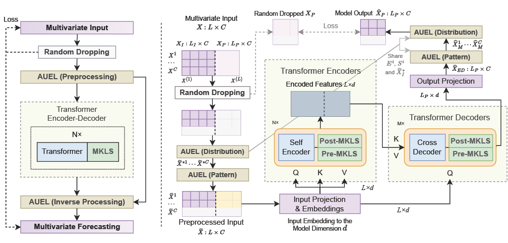

# ARM: Refining Multivariate Forecasting with Adaptive Temporal-Contextual Learning

This repository will host the code for the paper ["ARM: Refining Multivariate Forecasting with Adaptive Temporal-Contextual Learning"](https://arxiv.org/abs/2310.09488), presented at ICLR 2024.

## Code Release

The code will be released in mid-June. Please stay tuned. Thank you for your patience.

## Overall Architecture

